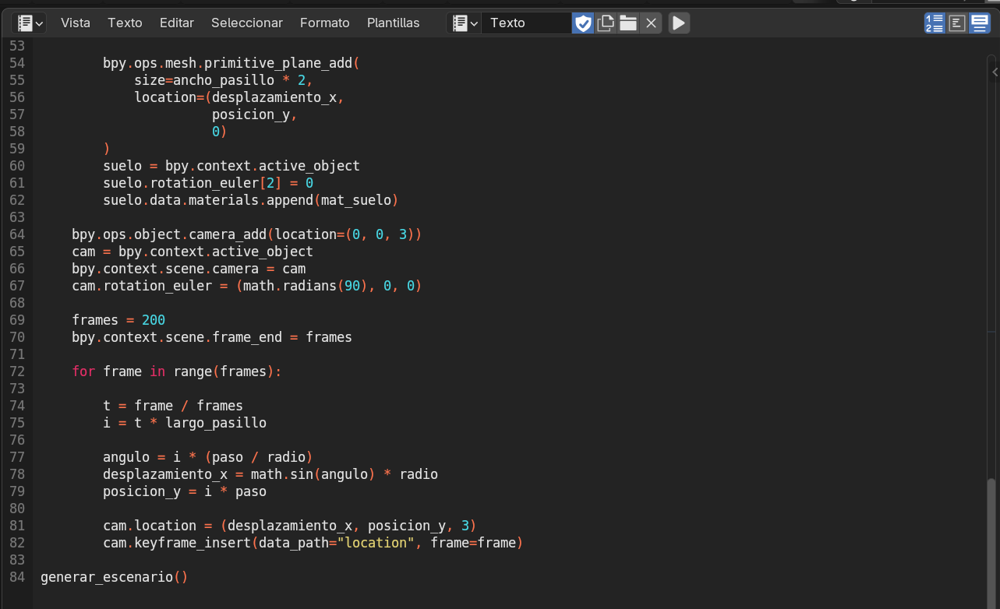
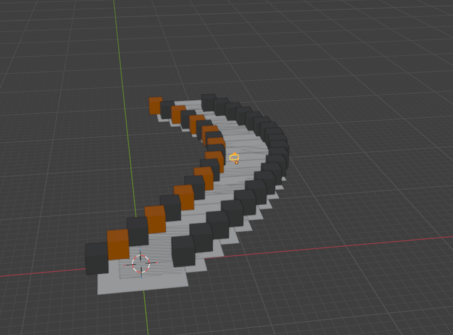

# Practica-2
Proyecto de pasillo curvo en Blender con animación de cámara

## Descripción

Este proyecto consiste en la generación de un pasillo y realizamos una modificacion de que el pasillo fuera curvo utilizando Python en Blender.
Se construye mediante la creación automatizada de dos paredes formadas por cubos alineados, manteniendo la estructura original del pasillo recto pero aplicando un desplazamiento progresivo para generar una curva suave. Además, se implementa una cámara animada que recorre el pasillo siguiendo la trayectoria definida.

## Objetivo

* Aplicar scripting en Blender usando Python.
* Generar geometría de manera procedural.
* Implementar animación de cámara.
* Comprender el uso de funciones matemáticas para crear curvas.

## Estructura del Proyecto
El proyecto incluye:

* Archivo `.blend` con la escena generada.
* Script `.py` que construye automáticamente:

  * Pared izquierda.
  * Pared derecha.
  * Piso ajustado a la curva.
  * Cámara animada.

## Funcionamiento

1. El script limpia la escena.
2. Genera materiales para las paredes.
3. Construye el pasillo utilizando un ciclo `for`.
4. Aplica una función seno para generar la curva.
5. Crea el piso siguiendo la misma trayectoria.
6. Añade una cámara que recorre el pasillo mediante keyframes.

## Resultados

Si quieres, puedo prepararte una versión más formal estilo ingeniería o una versión más simple dependiendo de cómo lo pida tu profesor.
